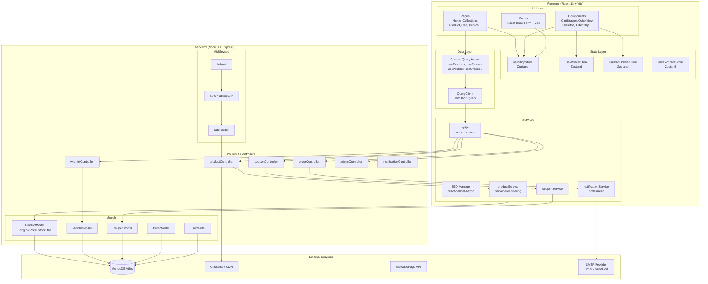
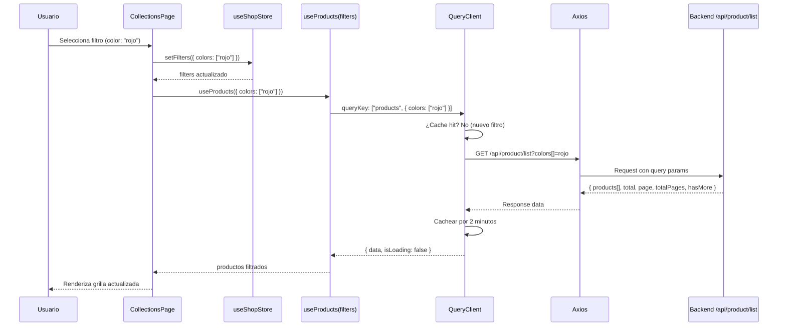

# Documento de Diseño Técnico — Harry's Boutique: Mejora Completa UX/UI

## Overview

Este documento describe la arquitectura técnica y el diseño de implementación para la mejora integral de Harry's Boutique. El sistema actual es funcional pero presenta limitaciones críticas: filtrado client-side que carga todos los productos en memoria, estado global frágil con race conditions en ShopContext, ausencia de caché de datos, y carencias en la experiencia de usuario.

La migración propuesta introduce:
- **Zustand** como store global reemplazando ShopContext
- **TanStack Query** para fetching, caché e invalidación de datos
- **Zod + React Hook Form** para validación tipada de formularios
- **Filtrado server-side** en el Catalog API
- **Nuevas funcionalidades**: wishlist, cupones, notificaciones email, búsqueda avanzada, SEO, dashboard admin

El diseño prioriza la compatibilidad con el stack existente (React 18, Vite 8, Tailwind 3.4, Express 4.21, MongoDB/Mongoose 8.8) y la migración incremental sin romper funcionalidad existente.

---

## Architecture

### Diagrama de Arquitectura General



### Flujo de Datos — Catálogo con Filtrado Server-Side



### Estructura de Carpetas Propuesta

```
frontend/src/
├── assets/
├── components/
│   ├── ui/                        # Componentes base del Design System
│   │   ├── Skeleton.jsx
│   │   ├── FilterChip.jsx
│   │   ├── ColorSwatch.jsx
│   │   ├── PriceRangeSlider.jsx
│   │   ├── ScrollToTop.jsx
│   │   └── Breadcrumb.jsx
│   ├── cart/
│   │   └── CartDrawer.jsx
│   ├── product/
│   │   ├── ProductItem.jsx
│   │   ├── QuickView.jsx
│   │   ├── ColorSwatchSelector.jsx
│   │   ├── StockIndicator.jsx
│   │   └── OrderTimeline.jsx
│   ├── checkout/
│   │   └── CheckoutStepper.jsx
│   ├── layout/
│   │   ├── Navbar.jsx
│   │   ├── Footer.jsx
│   │   └── SearchBar.jsx
│   └── seo/
│       └── SEOHead.jsx
├── hooks/                         # Custom hooks (no queries)
│   ├── useDebounce.js
│   ├── useIntersectionObserver.js
│   └── useLocalStorage.js
├── queries/                       # TanStack Query hooks
│   ├── useProducts.js
│   ├── useProduct.js
│   ├── useCategories.js
│   ├── useCart.js
│   ├── useWishlist.js
│   ├── useOrders.js
│   └── useAdminDashboard.js
├── stores/                        # Zustand stores
│   ├── useShopStore.js
│   ├── useWishlistStore.js
│   ├── useCartDrawerStore.js
│   └── useCompareStore.js
├── services/
│   └── api.js                     # Axios instance configurada
├── schemas/                       # Esquemas Zod
│   ├── checkoutSchema.js
│   ├── loginSchema.js
│   ├── registerSchema.js
│   └── profileSchema.js
├── pages/
│   ├── Home.jsx
│   ├── Collections.jsx
│   ├── Product.jsx
│   ├── Cart.jsx
│   ├── Wishlist.jsx
│   ├── PlaceOrder.jsx
│   ├── Orders.jsx
│   ├── Profile.jsx
│   └── Compare.jsx
├── context/
│   └── ShopContext.jsx            # Mantener durante migración incremental
├── App.jsx
└── main.jsx

admin/src/
├── components/
│   ├── ui/
│   │   ├── Skeleton.jsx
│   │   └── DataTable.jsx
│   ├── dashboard/
│   │   └── MetricCard.jsx
│   └── products/
│       └── DndImageUploader.jsx   # @dnd-kit/core
├── queries/
│   ├── useAdminDashboard.js
│   ├── useAdminProducts.js
│   ├── useAdminOrders.js
│   └── useAdminCustomers.js
├── stores/
│   └── useAdminStore.js
├── pages/
│   ├── Dashboard.jsx
│   ├── Add.jsx
│   ├── List.jsx
│   ├── Orders.jsx
│   ├── Customers.jsx
│   └── Coupons.jsx
└── App.jsx

backend/
├── controllers/
│   ├── productController.js       # Actualizado con server-side filtering
│   ├── wishlistController.js      # Nuevo
│   ├── couponController.js        # Nuevo
│   ├── adminController.js         # Nuevo (dashboard, customers)
│   └── notificationController.js  # Nuevo
├── services/
│   ├── productService.js          # Actualizado con filtering
│   ├── notificationService.js     # Nuevo (nodemailer)
│   └── couponService.js           # Nuevo
├── models/
│   ├── productModel.js            # Actualizado (+originalPrice, stock, faq)
│   ├── wishlistModel.js           # Nuevo
│   └── couponModel.js             # Nuevo
└── middleware/
    └── (existentes sin cambios)
```

---

## Components and Interfaces

### 1. CartDrawer

Panel lateral deslizante que se abre al agregar un producto al carrito.

```jsx
// frontend/src/components/cart/CartDrawer.jsx
import { AnimatePresence, motion } from 'framer-motion'
import { useCartDrawerStore } from '../../stores/useCartDrawerStore'
import { useShopStore } from '../../stores/useShopStore'

/**
 * @typedef {Object} CartDrawerProps
 * No recibe props — consume stores directamente
 */
const CartDrawer = () => {
  const { isOpen, close } = useCartDrawerStore()
  const { cartItems, products, updateQuantity, currency } = useShopStore()

  const cartEntries = Object.entries(cartItems).flatMap(([productId, sizes]) =>
    Object.entries(sizes)
      .filter(([, qty]) => qty > 0)
      .map(([size, qty]) => ({
        product: products.find((p) => p._id === productId),
        size,
        qty,
        productId,
      }))
      .filter((e) => e.product)
  )

  return (
    <AnimatePresence>
      {isOpen && (
        <>
          {/* Overlay */}
          <motion.div
            className="fixed inset-0 bg-black/40 z-40"
            initial={{ opacity: 0 }}
            animate={{ opacity: 1 }}
            exit={{ opacity: 0 }}
            onClick={close}
          />
          {/* Drawer */}
          <motion.aside
            className="fixed right-0 top-0 h-full w-full max-w-sm bg-white z-50 flex flex-col shadow-2xl"
            initial={{ x: '100%' }}
            animate={{ x: 0 }}
            exit={{ x: '100%' }}
            transition={{ type: 'tween', duration: 0.3 }}
            role="dialog"
            aria-modal="true"
            aria-label="Carrito de compras"
          >
            {/* Header */}
            <div className="flex items-center justify-between p-4 border-b">
              <h2 className="text-lg font-semibold">Tu carrito</h2>
              <button onClick={close} aria-label="Cerrar carrito">✕</button>
            </div>
            {/* Items */}
            <div className="flex-1 overflow-y-auto p-4 space-y-4">
              {cartEntries.map(({ product, size, qty, productId }) => (
                <CartDrawerItem
                  key={`${productId}-${size}`}
                  product={product}
                  size={size}
                  qty={qty}
                  onUpdate={(newQty) => updateQuantity(productId, size, newQty)}
                  currency={currency}
                />
              ))}
            </div>
            {/* Footer */}
            <CartDrawerFooter entries={cartEntries} currency={currency} onClose={close} />
          </motion.aside>
        </>
      )}
    </AnimatePresence>
  )
}
```

**Props de CartDrawerItem:**
| Prop | Tipo | Descripción |
|------|------|-------------|
| product | ProductModel | Datos del producto |
| size | string | Talla seleccionada |
| qty | number | Cantidad actual |
| onUpdate | (qty: number) => void | Callback para actualizar cantidad |
| currency | string | Símbolo de moneda |

### 2. QuickView

Modal de vista rápida de producto.

```jsx
// frontend/src/components/product/QuickView.jsx
/**
 * @typedef {Object} QuickViewProps
 * @property {string|null} productId - ID del producto a mostrar, null = cerrado
 * @property {() => void} onClose - Callback para cerrar el modal
 */
const QuickView = ({ productId, onClose }) => {
  const { data: product, isLoading } = useProduct(productId)
  const { open: openDrawer } = useCartDrawerStore()
  const { addToCart } = useShopStore()
  const [selectedSize, setSelectedSize] = useState(null)
  const [selectedColor, setSelectedColor] = useState(null)

  // Trap focus dentro del modal
  useEffect(() => {
    if (!productId) return
    const handleKeyDown = (e) => { if (e.key === 'Escape') onClose() }
    document.addEventListener('keydown', handleKeyDown)
    document.body.style.overflow = 'hidden'
    return () => {
      document.removeEventListener('keydown', handleKeyDown)
      document.body.style.overflow = ''
    }
  }, [productId, onClose])

  const handleAddToCart = () => {
    if (!selectedSize) return
    addToCart(product._id, selectedSize)
    openDrawer()
    onClose()
  }

  // ...render
}
```

### 3. Skeleton

Componente base reutilizable para loading states.

```jsx
// frontend/src/components/ui/Skeleton.jsx
/**
 * @typedef {Object} SkeletonProps
 * @property {string} [className] - Clases Tailwind adicionales
 * @property {'rect'|'circle'|'text'} [variant='rect'] - Forma del skeleton
 */
const Skeleton = ({ className = '', variant = 'rect' }) => {
  const base = 'animate-pulse bg-gray-200'
  const variants = {
    rect: 'rounded-md',
    circle: 'rounded-full',
    text: 'rounded h-4',
  }
  return <div className={`${base} ${variants[variant]} ${className}`} aria-hidden="true" />
}

// Composición para tarjeta de producto
export const ProductCardSkeleton = () => (
  <div className="space-y-2">
    <Skeleton className="aspect-[3/4] w-full" />
    <Skeleton variant="text" className="w-3/4" />
    <Skeleton variant="text" className="w-1/3" />
  </div>
)

// Composición para grilla de catálogo
export const CatalogGridSkeleton = ({ count = 12 }) => (
  <div className="grid grid-cols-2 md:grid-cols-3 lg:grid-cols-4 gap-4">
    {Array.from({ length: count }).map((_, i) => (
      <ProductCardSkeleton key={i} />
    ))}
  </div>
)
```

### 4. FilterChip

Chip removible para filtros activos.

```jsx
// frontend/src/components/ui/FilterChip.jsx
/**
 * @typedef {Object} FilterChipProps
 * @property {string} label - Texto del filtro
 * @property {() => void} onRemove - Callback para remover el filtro
 */
const FilterChip = ({ label, onRemove }) => (
  <span className="inline-flex items-center gap-1 px-3 py-1 rounded-full bg-gray-100 text-sm text-gray-700 border border-gray-200">
    {label}
    <button
      onClick={onRemove}
      className="ml-1 hover:text-red-500 transition-colors"
      aria-label={`Remover filtro ${label}`}
    >
      ✕
    </button>
  </span>
)
```

### 5. ColorSwatch

Selector visual de color.

```jsx
// frontend/src/components/ui/ColorSwatch.jsx
/**
 * @typedef {Object} ColorSwatchProps
 * @property {string} color - Valor CSS del color (hex, nombre, etc.)
 * @property {string} label - Nombre del color para accesibilidad
 * @property {boolean} selected - Si está seleccionado
 * @property {() => void} onClick - Callback de selección
 * @property {'sm'|'md'|'lg'} [size='md'] - Tamaño del swatch
 */
const ColorSwatch = ({ color, label, selected, onClick, size = 'md' }) => {
  const sizes = { sm: 'w-5 h-5', md: 'w-6 h-6', lg: 'w-8 h-8' }
  return (
    <button
      onClick={onClick}
      className={`${sizes[size]} rounded-full border-2 transition-all ${
        selected ? 'border-gray-900 scale-110' : 'border-transparent hover:border-gray-400'
      }`}
      style={{ backgroundColor: color }}
      aria-label={label}
      aria-pressed={selected}
      title={label}
    />
  )
}
```

### 6. OrderTimeline

Timeline visual de estados de orden.

```jsx
// frontend/src/components/product/OrderTimeline.jsx
const ORDER_STEPS = [
  { key: 'pending',    label: 'Pendiente',   icon: '🕐' },
  { key: 'processing', label: 'Procesando',  icon: '📦' },
  { key: 'shipped',    label: 'Enviado',     icon: '🚚' },
  { key: 'delivered',  label: 'Entregado',   icon: '✅' },
]

/**
 * @typedef {Object} OrderTimelineProps
 * @property {'pending'|'processing'|'shipped'|'delivered'} status - Estado actual
 * @property {boolean} [compact=false] - Versión compacta para listas
 */
const OrderTimeline = ({ status, compact = false }) => {
  const currentIndex = ORDER_STEPS.findIndex((s) => s.key === status)
  return (
    <div className={`flex ${compact ? 'gap-2' : 'gap-4'} items-center`}>
      {ORDER_STEPS.map((step, i) => {
        const isCompleted = i <= currentIndex
        const isCurrent = i === currentIndex
        return (
          <React.Fragment key={step.key}>
            <div className="flex flex-col items-center gap-1">
              <div className={`w-8 h-8 rounded-full flex items-center justify-center text-sm
                ${isCompleted ? 'bg-green-500 text-white' : 'bg-gray-200 text-gray-400'}
                ${isCurrent ? 'ring-2 ring-green-300 ring-offset-1' : ''}`}>
                {step.icon}
              </div>
              {!compact && <span className={`text-xs ${isCompleted ? 'text-green-600' : 'text-gray-400'}`}>{step.label}</span>}
            </div>
            {i < ORDER_STEPS.length - 1 && (
              <div className={`flex-1 h-0.5 ${i < currentIndex ? 'bg-green-500' : 'bg-gray-200'}`} />
            )}
          </React.Fragment>
        )
      })}
    </div>
  )
}
```

### 7. CheckoutStepper

```jsx
// frontend/src/components/checkout/CheckoutStepper.jsx
const CHECKOUT_STEPS = ['Envío', 'Pago', 'Confirmación']

/**
 * @typedef {Object} CheckoutStepperProps
 * @property {0|1|2} currentStep - Índice del paso actual
 */
const CheckoutStepper = ({ currentStep }) => (
  <div className="flex items-center justify-center gap-0 mb-8">
    {CHECKOUT_STEPS.map((label, i) => (
      <React.Fragment key={label}>
        <div className="flex flex-col items-center gap-1">
          <div className={`w-8 h-8 rounded-full flex items-center justify-center text-sm font-medium
            ${i < currentStep ? 'bg-gray-900 text-white' : ''}
            ${i === currentStep ? 'bg-gray-900 text-white ring-2 ring-gray-300 ring-offset-2' : ''}
            ${i > currentStep ? 'bg-gray-200 text-gray-500' : ''}`}>
            {i < currentStep ? '✓' : i + 1}
          </div>
          <span className={`text-xs ${i <= currentStep ? 'text-gray-900' : 'text-gray-400'}`}>{label}</span>
        </div>
        {i < CHECKOUT_STEPS.length - 1 && (
          <div className={`w-16 h-0.5 mb-5 ${i < currentStep ? 'bg-gray-900' : 'bg-gray-200'}`} />
        )}
      </React.Fragment>
    ))}
  </div>
)
```

### 8. Breadcrumb

```jsx
// frontend/src/components/ui/Breadcrumb.jsx
/**
 * @typedef {Object} BreadcrumbItem
 * @property {string} label - Texto del item
 * @property {string} [href] - Ruta de navegación (undefined = item actual)
 *
 * @typedef {Object} BreadcrumbProps
 * @property {BreadcrumbItem[]} items - Items del breadcrumb
 */
const Breadcrumb = ({ items }) => (
  <nav aria-label="Breadcrumb" className="hidden sm:flex items-center gap-2 text-sm text-gray-500 mb-4">
    {items.map((item, i) => (
      <React.Fragment key={i}>
        {i > 0 && <span aria-hidden="true">/</span>}
        {item.href ? (
          <Link to={item.href} className="hover:text-gray-900 transition-colors">{item.label}</Link>
        ) : (
          <span className="text-gray-900 font-medium" aria-current="page">{item.label}</span>
        )}
      </React.Fragment>
    ))}
  </nav>
)
```

### 9. ScrollToTop

```jsx
// frontend/src/components/ui/ScrollToTop.jsx
const ScrollToTop = () => {
  const [visible, setVisible] = useState(false)

  useEffect(() => {
    const onScroll = () => setVisible(window.scrollY > 400)
    window.addEventListener('scroll', onScroll, { passive: true })
    return () => window.removeEventListener('scroll', onScroll)
  }, [])

  return (
    <AnimatePresence>
      {visible && (
        <motion.button
          className="fixed bottom-6 right-6 z-30 w-10 h-10 rounded-full bg-gray-900 text-white flex items-center justify-center shadow-lg"
          onClick={() => window.scrollTo({ top: 0, behavior: 'smooth' })}
          initial={{ opacity: 0, scale: 0.8 }}
          animate={{ opacity: 1, scale: 1 }}
          exit={{ opacity: 0, scale: 0.8 }}
          transition={{ duration: 0.2 }}
          aria-label="Volver al inicio"
        >
          ↑
        </motion.button>
      )}
    </AnimatePresence>
  )
}
```

### 10. PriceRangeSlider

```jsx
// frontend/src/components/ui/PriceRangeSlider.jsx
/**
 * @typedef {Object} PriceRangeSliderProps
 * @property {number} min - Precio mínimo absoluto
 * @property {number} max - Precio máximo absoluto
 * @property {number} value[0] - Precio mínimo seleccionado
 * @property {number} value[1] - Precio máximo seleccionado
 * @property {([min, max]: [number, number]) => void} onChange - Callback al soltar el handle
 * @property {string} currency - Símbolo de moneda
 */
const PriceRangeSlider = ({ min, max, value, onChange, currency }) => {
  const [localValue, setLocalValue] = useState(value)

  return (
    <div className="space-y-3">
      <div className="flex justify-between text-sm text-gray-600">
        <span>{currency}{localValue[0].toLocaleString('es-CL')}</span>
        <span>{currency}{localValue[1].toLocaleString('es-CL')}</span>
      </div>
      <div className="relative h-2">
        {/* Track */}
        <div className="absolute inset-0 bg-gray-200 rounded-full" />
        {/* Active range */}
        <div
          className="absolute h-full bg-gray-900 rounded-full"
          style={{
            left: `${((localValue[0] - min) / (max - min)) * 100}%`,
            right: `${100 - ((localValue[1] - min) / (max - min)) * 100}%`,
          }}
        />
        {/* Min handle */}
        <input type="range" min={min} max={max} value={localValue[0]}
          onChange={(e) => setLocalValue([+e.target.value, localValue[1]])}
          onMouseUp={() => onChange(localValue)}
          onTouchEnd={() => onChange(localValue)}
          className="absolute inset-0 w-full opacity-0 cursor-pointer" />
        {/* Max handle */}
        <input type="range" min={min} max={max} value={localValue[1]}
          onChange={(e) => setLocalValue([localValue[0], +e.target.value])}
          onMouseUp={() => onChange(localValue)}
          onTouchEnd={() => onChange(localValue)}
          className="absolute inset-0 w-full opacity-0 cursor-pointer" />
      </div>
    </div>
  )
}
```
