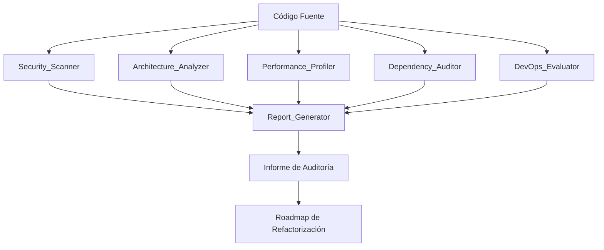
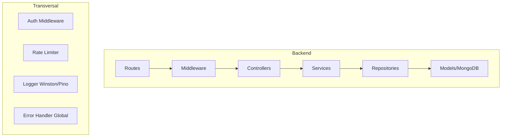
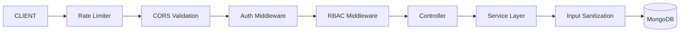

# Diseño: Auditoría Técnica y Refactorización — Harry's Boutique

## Overview

Este documento describe el diseño del sistema de auditoría técnica para el e-commerce Harry's Boutique. El objetivo es analizar el estado actual del proyecto (Backend Node.js/Express/MongoDB, Admin Panel React/Vite, Frontend Cliente React/Vite), identificar problemas críticos y generar un plan de refactorización priorizado.

El sistema de auditoría no es una aplicación nueva sino un proceso estructurado de análisis que produce un informe de diagnóstico con hallazgos clasificados, propuestas de solución y un roadmap de refactorización por fases.

### Hallazgos Críticos Identificados en el Análisis Inicial

Del análisis del código fuente se identificaron los siguientes problemas de alta prioridad:

**Seguridad Crítica:**
- `adminAuth.js` verifica el token comparando `token_decode.email !== process.env.ADMIN_EMAIL + process.env.ADMIN_PASSWORD` — el payload del JWT contiene la concatenación de email y password en texto plano como identificador
- `userController.js` genera el token admin con `{ email: process.env.ADMIN_EMAIL + process.env.ADMIN_PASSWORD }` — las credenciales de admin están embebidas en el payload del JWT
- El token admin no tiene expiración (`jwt.sign(...)` sin `expiresIn`)
- `auth.js` tiene logs de debug con información sensible en producción (`console.log` con headers completos, token parcial, JWT_SECRET existence)
- No existe rate limiting en ninguna ruta
- No existe sanitización contra inyección NoSQL
- Los tokens JWT se almacenan en `localStorage` (vulnerable a XSS)

**Arquitectura:**
- No existe capa de servicios — la lógica de negocio está directamente en los controladores
- `productController.js` mezcla lógica de negocio (gestión de categorías) con lógica de presentación
- `ShopContext.jsx` concentra demasiada responsabilidad (estado global, llamadas API, navegación)
- Código duplicado entre `frontend` y `admin` (componentes similares, lógica de autenticación)

**Base de Datos:**
- `productModel.js` no define índices en `category`, `subCategory`, `bestSeller`, `date`
- `orderModel.js` no define índices en `userId`, `status`
- `userModel.js` almacena `cartData` como `Object` sin estructura tipada
- `orderModel.js` usa `mongoose.model.order` (error tipográfico — debería ser `mongoose.models.order`)
- No existe sistema de migraciones ni versionado de schema

**DevOps:**
- No existe Docker/Docker Compose
- No existe CI/CD pipeline
- No existe comando único para levantar los tres servicios
- No existe sistema de seeds automatizado (aunque hay seed básico de categorías en `server.js`)

**Testing:**
- No existe ningún test (unitario, integración, E2E)
- No existe framework de testing configurado
- No existe configuración de pre-commit hooks

**Logging:**
- `auth.js` usa `console.log` extensivo con datos sensibles
- No existe logger estructurado (Winston/Pino)
- No existe manejo centralizado de errores
- No existe error tracking en frontend

---

## Architecture

El sistema de auditoría se estructura como un proceso de análisis en fases que produce artefactos documentales. La arquitectura del proceso sigue este flujo:



### Arquitectura Objetivo Post-Refactorización

La arquitectura objetivo para el backend sigue el patrón de capas:



### Arquitectura de Seguridad Objetivo



---

## Components and Interfaces

### Componentes del Sistema de Auditoría

#### Security_Scanner
Responsable de identificar vulnerabilidades de seguridad en el código fuente.

**Áreas de análisis:**
- Credenciales expuestas en archivos de configuración
- Esquemas de autenticación inseguros
- Ausencia de rate limiting
- Validación y sanitización de inputs
- Configuración CORS
- Almacenamiento de tokens

**Interfaz de salida:**
```typescript
interface SecurityFinding {
  id: string
  category: 'OWASP_A01' | 'OWASP_A02' | 'OWASP_A03' | 'OWASP_A07' | string
  severity: 'critical' | 'high' | 'medium' | 'low'
  location: string        // archivo y línea
  description: string
  recommendation: string
  codeExample?: string
}
```

#### Architecture_Analyzer
Evalúa la estructura del proyecto, separación de responsabilidades y patrones de diseño.

**Áreas de análisis:**
- Separación controllers/services/repositories
- Violaciones SOLID
- Acoplamiento entre módulos
- Reutilización de componentes entre frontend y admin
- Adecuación de la gestión de estado

#### Performance_Profiler
Identifica cuellos de botella en base de datos y frontend.

**Áreas de análisis:**
- Índices faltantes en MongoDB
- Queries N+1
- Lazy loading y code splitting en frontend
- Optimización de imágenes

#### Dependency_Auditor
Analiza el estado de las dependencias en los tres proyectos.

**Áreas de análisis:**
- Versiones desactualizadas
- Vulnerabilidades conocidas (npm audit)
- Dependencias duplicadas o innecesarias
- Bundle size impact

#### DevOps_Evaluator
Evalúa la infraestructura de desarrollo y despliegue.

**Áreas de análisis:**
- Containerización (Docker/Docker Compose)
- CI/CD pipelines
- Gestión de variables de entorno
- Developer experience (DX)

#### Report_Generator
Consolida todos los hallazgos y genera el informe final con roadmap.

**Interfaz de salida:**
```typescript
interface AuditReport {
  summary: {
    totalIssues: number
    criticalCount: number
    highCount: number
    mediumCount: number
    lowCount: number
  }
  findings: Finding[]
  roadmap: Phase[]
  quickWins: Finding[]
  backendComparison: ComparisonMatrix
}

interface Finding {
  id: string
  category: 'Security' | 'Architecture' | 'Performance' | 'DevOps' | 'Testing' | 'Dependencies'
  risk: 'Crítico' | 'Alto' | 'Medio' | 'Bajo'
  priority: 'Alta' | 'Media' | 'Baja'
  description: string
  solution: string
  effort: 'low' | 'medium' | 'high'
  codeExample?: string
}

interface Phase {
  name: string
  duration: string
  items: Finding[]
}
```

---

## Data Models

### Modelos Actuales y Problemas Identificados

#### userModel — Problemas
```javascript
// PROBLEMA: cartData como Object sin estructura tipada
cartData: { type: Object, default: {} }
// MEJORA: Definir estructura explícita o mover carrito a colección separada

// PROBLEMA: Sin índice en email (aunque unique: true crea índice implícito, es buena práctica declararlo)
// MEJORA: Agregar índice explícito
userSchema.index({ email: 1 })

// PROBLEMA: createdAt/updatedAt manejados manualmente
// MEJORA: Usar timestamps: true de Mongoose
```

#### productModel — Problemas
```javascript
// PROBLEMA: Sin índices para queries frecuentes
// MEJORA:
productSchema.index({ category: 1, subCategory: 1 })
productSchema.index({ bestSeller: 1 })
productSchema.index({ date: -1 })
productSchema.index({ 'rating.average': -1 })
```

#### orderModel — Problemas
```javascript
// PROBLEMA CRÍTICO: Error tipográfico en registro del modelo
const orderModel = mongoose.model.order || mongoose.model('order', orderSchema)
// CORRECCIÓN:
const orderModel = mongoose.models.order || mongoose.model('order', orderSchema)

// PROBLEMA: Sin índices para queries frecuentes
// MEJORA:
orderSchema.index({ userId: 1, date: -1 })
orderSchema.index({ status: 1 })

// PROBLEMA: items y address como Array/Object sin tipado
// MEJORA: Definir sub-schemas explícitos
```

### Modelo de Roles Propuesto

```javascript
const roleSchema = new mongoose.Schema({
  name: { type: String, enum: ['OWNER', 'ADMIN', 'MODERATOR', 'USER'], required: true },
  permissions: [{ type: String }]
})

// Actualización a userModel
const userSchema = new mongoose.Schema({
  // ... campos existentes
  role: { type: String, enum: ['OWNER', 'ADMIN', 'MODERATOR', 'USER'], default: 'USER' },
}, { timestamps: true }) // Reemplaza createdAt/updatedAt manuales
```

### Modelo de Audit Log Propuesto

```javascript
const auditLogSchema = new mongoose.Schema({
  userId: { type: mongoose.Schema.Types.ObjectId, ref: 'user', required: true },
  action: { type: String, required: true },
  resource: { type: String, required: true },
  resourceId: { type: String },
  changes: { type: Object },
  ip: { type: String },
  userAgent: { type: String },
}, { timestamps: true })

auditLogSchema.index({ userId: 1, createdAt: -1 })
auditLogSchema.index({ resource: 1, createdAt: -1 })
```

---

## Correctness Properties

*Una propiedad es una característica o comportamiento que debe mantenerse verdadero en todas las ejecuciones válidas del sistema — esencialmente, una declaración formal sobre lo que el sistema debe hacer. Las propiedades sirven como puente entre especificaciones legibles por humanos y garantías de corrección verificables por máquinas.*

Del análisis de criterios de aceptación, la mayoría corresponden a verificaciones estructurales (SMOKE) sobre presencia/ausencia de configuraciones, patrones de código y herramientas. Sin embargo, se identificaron tres criterios con propiedades universales verificables mediante property-based testing:

### Property 1: Resistencia a inyección NoSQL

*Para cualquier* payload de entrada a los endpoints de la API que contenga operadores MongoDB (`$gt`, `$lt`, `$where`, `$regex`, `$ne`, `$in`, etc.), el sistema SHALL rechazar o sanitizar la entrada sin ejecutar la query maliciosa ni exponer datos no autorizados.

**Validates: Requirements 1.5**

### Property 2: Protección contra brute force en login

*Para cualquier* secuencia de N intentos de login fallidos consecutivos desde la misma IP (donde N supera el umbral configurado), el sistema SHALL rechazar los intentos subsiguientes con HTTP 429 antes de que el umbral sea alcanzado en la siguiente ventana de tiempo.

**Validates: Requirements 4.7**

### Property 3: Clasificación exhaustiva de hallazgos

*Para cualquier* hallazgo identificado por el sistema de auditoría, el Report_Generator SHALL asignar exactamente un nivel de riesgo del conjunto `{Crítico, Alto, Medio, Bajo}` y exactamente una categoría del conjunto `{Security, Architecture, Performance, DevOps, Testing, Dependencies}`.

**Validates: Requirements 11.3, 11.4**

---

## Error Handling

### Estado Actual — Problemas Identificados

1. **Sin middleware de error handling global** — cada controlador maneja errores individualmente con patrones inconsistentes (algunos usan `res.json({success: false})`, otros `res.status(500).json(...)`)
2. **Logs de debug en producción** — `auth.js` expone headers completos, tokens parciales y estado de variables de entorno en `console.log`
3. **Sin error tracking en frontend** — errores de JavaScript en producción son silenciosos
4. **Respuestas de error inconsistentes** — mezcla de HTTP 200 con `{success: false}` y HTTP 4xx/5xx

### Diseño Propuesto

#### Middleware de Error Handling Global (Backend)

```javascript
// middleware/errorHandler.js
const errorHandler = (err, req, res, next) => {
  const logger = req.app.get('logger')
  
  logger.error({
    message: err.message,
    stack: process.env.NODE_ENV === 'development' ? err.stack : undefined,
    path: req.path,
    method: req.method,
    userId: req.user?.id,
  })

  const statusCode = err.statusCode || 500
  res.status(statusCode).json({
    success: false,
    message: process.env.NODE_ENV === 'production' 
      ? 'Error interno del servidor' 
      : err.message,
    ...(process.env.NODE_ENV === 'development' && { stack: err.stack })
  })
}
```

#### Clases de Error Personalizadas

```javascript
class AppError extends Error {
  constructor(message, statusCode) {
    super(message)
    this.statusCode = statusCode
    this.isOperational = true
  }
}

class ValidationError extends AppError {
  constructor(message) { super(message, 400) }
}

class AuthenticationError extends AppError {
  constructor(message) { super(message, 401) }
}

class AuthorizationError extends AppError {
  constructor(message) { super(message, 403) }
}

class NotFoundError extends AppError {
  constructor(message) { super(message, 404) }
}
```

#### Estrategia de Logging Estructurado

```javascript
// config/logger.js — usando Winston
import winston from 'winston'

const logger = winston.createLogger({
  level: process.env.LOG_LEVEL || 'info',
  format: winston.format.combine(
    winston.format.timestamp(),
    winston.format.errors({ stack: true }),
    winston.format.json()
  ),
  transports: [
    new winston.transports.Console({
      format: process.env.NODE_ENV === 'development'
        ? winston.format.simple()
        : winston.format.json()
    }),
    new winston.transports.File({ filename: 'logs/error.log', level: 'error' }),
    new winston.transports.File({ filename: 'logs/combined.log' }),
  ]
})
```

---

## Testing Strategy

### Evaluación de PBT

Este spec es principalmente un proceso de auditoría y generación de documentación. La mayoría de los criterios de aceptación son verificaciones estructurales (SMOKE) sobre presencia/ausencia de configuraciones y patrones. Solo tres criterios son candidatos a property-based testing (ver sección Correctness Properties).

### Estrategia de Testing para el Proyecto Auditado

La estrategia de testing propuesta para Harry's Boutique post-refactorización:

#### Unit Tests (Vitest para frontend/admin, Jest para backend)

Enfocados en:
- Lógica de negocio en la capa de servicios
- Funciones de validación y sanitización
- Transformaciones de datos
- Utilidades puras

```javascript
// Ejemplo: test unitario para validación de input
describe('validateProductInput', () => {
  it('rechaza precio negativo', () => {
    expect(() => validateProductInput({ price: -1 })).toThrow(ValidationError)
  })
  it('rechaza nombre vacío', () => {
    expect(() => validateProductInput({ name: '' })).toThrow(ValidationError)
  })
})
```

#### Property-Based Tests (fast-check)

Para las tres propiedades identificadas, usando `fast-check` como librería PBT:

```javascript
// Property 1: Resistencia a inyección NoSQL
// Feature: technical-audit-and-refactoring, Property 1: NoSQL injection resistance
import fc from 'fast-check'

test('endpoints rechazan operadores MongoDB en inputs', () => {
  const mongoOperators = fc.oneof(
    fc.record({ $gt: fc.string() }),
    fc.record({ $where: fc.string() }),
    fc.record({ $regex: fc.string() }),
    fc.record({ $ne: fc.anything() }),
  )
  
  fc.assert(
    fc.asyncProperty(mongoOperators, async (maliciousPayload) => {
      const response = await request(app)
        .post('/api/user/login')
        .send({ email: maliciousPayload, password: 'test' })
      
      // No debe retornar datos de usuario ni status 200 con success: true
      expect(response.body.success).toBe(false)
    }),
    { numRuns: 100 }
  )
})
```

```javascript
// Property 2: Brute force protection
// Feature: technical-audit-and-refactoring, Property 2: brute force protection
test('rate limiter bloquea intentos excesivos de login', () => {
  fc.assert(
    fc.asyncProperty(
      fc.integer({ min: 6, max: 20 }), // intentos sobre el umbral de 5
      async (attempts) => {
        for (let i = 0; i < attempts; i++) {
          await request(app)
            .post('/api/user/login')
            .send({ email: 'test@test.com', password: 'wrong' })
        }
        const finalResponse = await request(app)
          .post('/api/user/login')
          .send({ email: 'test@test.com', password: 'wrong' })
        
        expect(finalResponse.status).toBe(429)
      }
    ),
    { numRuns: 100 }
  )
})
```

```javascript
// Property 3: Clasificación exhaustiva de hallazgos
// Feature: technical-audit-and-refactoring, Property 3: exhaustive finding classification
const VALID_RISKS = ['Crítico', 'Alto', 'Medio', 'Bajo']
const VALID_CATEGORIES = ['Security', 'Architecture', 'Performance', 'DevOps', 'Testing', 'Dependencies']

test('todos los hallazgos tienen clasificación válida', () => {
  fc.assert(
    fc.property(
      fc.array(fc.record({
        description: fc.string({ minLength: 1 }),
        location: fc.string({ minLength: 1 }),
      }), { minLength: 1, maxLength: 50 }),
      (rawFindings) => {
        const classified = classifyFindings(rawFindings)
        return classified.every(f =>
          VALID_RISKS.includes(f.risk) &&
          VALID_CATEGORIES.includes(f.category)
        )
      }
    ),
    { numRuns: 100 }
  )
})
```

#### Integration Tests

- Flujos completos de autenticación (login → token → acceso a ruta protegida)
- CRUD de productos con Cloudinary mockeado
- Flujo de órdenes completo
- Integración con MercadoPago (sandbox)

#### E2E Tests (Playwright)

- Flujo de compra completo (browse → cart → checkout → payment)
- Flujo de administración (login admin → crear producto → verificar en frontend)
- Flujo de registro y login de usuario

#### Pre-commit Hooks (Husky + lint-staged)

```json
// package.json (raíz del monorepo)
{
  "lint-staged": {
    "**/*.{js,jsx,ts,tsx}": ["eslint --fix", "prettier --write"],
    "**/*.{json,md,css}": ["prettier --write"]
  }
}
```

### Roadmap de Refactorización por Fases

#### Fase 1 — Quick Wins (1-2 semanas)
Problemas críticos de seguridad con bajo esfuerzo:
1. Corregir `adminAuth.js` — reemplazar payload inseguro por `{ adminId: 'admin', role: 'ADMIN' }`
2. Agregar `expiresIn` al token admin
3. Eliminar `console.log` con datos sensibles de `auth.js`
4. Corregir error tipográfico en `orderModel.js` (`mongoose.model.order` → `mongoose.models.order`)
5. Agregar índices faltantes en `productModel` y `orderModel`
6. Configurar rate limiting con `express-rate-limit`

#### Fase 2 — Seguridad y Arquitectura Base (2-4 semanas)
1. Implementar sanitización NoSQL con `express-mongo-sanitize`
2. Implementar capa de servicios (extraer lógica de negocio de controladores)
3. Configurar Winston/Pino como logger estructurado
4. Implementar middleware de error handling global
5. Migrar tokens a httpOnly cookies o implementar refresh token strategy
6. Configurar framework de testing (Jest + Vitest)

#### Fase 3 — Sistema de Roles y Admin Panel (3-5 semanas)
1. Implementar RBAC (OWNER, ADMIN, MODERATOR, USER)
2. Agregar audit logs para acciones administrativas
3. Implementar módulo de configuración centralizado en Admin Panel
4. Agregar bulk operations y filtros avanzados en Admin Panel

#### Fase 4 — DevOps y Developer Experience (2-3 semanas)
1. Crear Docker Compose con servicios para MongoDB, Backend, Admin, Frontend
2. Configurar CI/CD con GitHub Actions (lint → test → build → deploy)
3. Implementar sistema de migraciones con `migrate-mongo`
4. Configurar pre-commit hooks con Husky

#### Fase 5 — Performance y Optimización (2-3 semanas)
1. Implementar paginación en endpoints de listado
2. Agregar caché con Redis para productos y categorías
3. Optimizar imágenes con transformaciones Cloudinary
4. Evaluar migración de ShopContext a Zustand

### Análisis Comparativo: Firebase vs Backend Propio vs Híbrido

| Criterio | Backend Propio (actual) | Firebase | Híbrido |
|---|---|---|---|
| Control total | ✅ Alto | ❌ Bajo | 🟡 Medio |
| Velocidad de desarrollo | 🟡 Medio | ✅ Alto | 🟡 Medio |
| Costo (escala baja) | ✅ Bajo | ✅ Bajo | 🟡 Medio |
| Costo (escala alta) | ✅ Predecible | ❌ Alto | 🟡 Variable |
| Vendor lock-in | ✅ Ninguno | ❌ Alto | 🟡 Parcial |
| Complejidad de migración | N/A | ❌ Alta | 🟡 Media |
| Escalabilidad | 🟡 Manual | ✅ Automática | ✅ Automática (auth/storage) |
| Lógica de negocio compleja | ✅ Ideal | 🟡 Cloud Functions | ✅ Ideal |
| Equipo pequeño | 🟡 Requiere DevOps | ✅ Ideal | 🟡 Medio |

**Recomendación:** Mantener el backend propio con las refactorizaciones propuestas. El proyecto tiene lógica de negocio específica (MercadoPago, gestión de categorías, reviews) que se beneficia del control total. Firebase introduciría vendor lock-in significativo y costos impredecibles a escala. La opción híbrida (Firebase Auth + backend propio) podría considerarse solo si el equipo quiere eliminar la gestión de autenticación, pero el costo de migración no justifica el beneficio dado que el sistema de auth actual es corregible con bajo esfuerzo.
